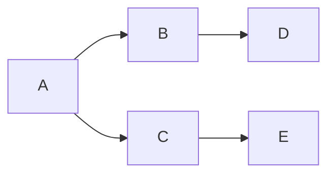

## Headnote

*Reader, this is an old and informal project from graduate school. I continue to use real option analysis in everyday like, sometimes in real time when making decisions; others I sit and calculate whether it's worth the resources to do something after a decision is made, more information is learned, or just because this is future risk ("uncertainty"). I made minor revisions and updated sources and references as best I could.*

### Real Options in Everyday Life

Real option valuation recognizes that decisions often carry embedded flexibility—the ability to wait, pivot, or walk away based on new information. While traditionally applied to business investments, this framework is surprisingly useful for everyday choices.

### The Core Insight

Many decisions aren't now-or-never propositions. The value lies not just in the immediate action, but in preserving—or cashing in—future flexibility.

#### Parking Dilemma

The parking spot dilemma illustrates the "search cost vs. opportunity cost" trade-off. Circling for a closer spot is like paying a premium (in time and gas) for a small convenience gain. You're exercising your option to search, but at a cost. The rational choice depends on how you value your time, how certain you are about finding something better, and what you're giving up by continuing to search. On a relaxed Saturday, the option to keep looking has low cost. Before a critical meeting, that same option becomes expensive—better to "lock in" the first spot and preserve certainty.

#### Home Renovation Gone Wrong

An "abandon vs. escalate" option. When your contractor uncovers foundation problems mid-project, you face a classic real options scenario: you've already sunk $Y$ dollars, but continuing costs $X$ more with uncertain future costs $Z$. The key question isn't "how much have I already spent?" (that's gone - or sunk - regardless), but "given what I now know, is continuing this project worth the additional investment?" Sometimes the most valuable option is the one to walk away, even after significant commitment, because new information has changed the project's expected value. Likewise, it may be worth to continue and perform the same valuation if another problem arises, or even if more information is learned to better evaluate future risks of problems.

The framework reminds us that, 1) information has value, 2) timing matters, and 3) flexibility itself is worth something, and it is possible to calculate this value.

## Summary

My project is to develop a binomial option pricing model to value the option to settle a civil lawsuit. An experienced lawyer may have some “intuition” on the chances of winning a civil action. There is little knowledge to substantiate this intuition early on in the process (i.e. when the plaintiff-client first walks in to the lawyer’s office). However, as time goes on: through the initial complaint, pre-trial discovery process, and the eventual trial, there is always the option to attempt to settle. Although there are many risks involved in either outcome (settling or letting the jury/judge decide), a binomial option pricing model may help guide the lawyer and client, rather than relying on intuition/experience.

The following discussion will be assuming the role of the plaintiff in an action without a counterclaim by the defendant (meaning that the most the plaintiff can lose is the case, and nothing more). This would make the option a put: the right, but not the obligation to settle (“sell”) his case. In this scenario, the underlying asset would be judgment award upon successful carrying of the claim. Therefore, it would be in the plaintiff’s best interest to exercise when they believe that they will either, 1) not win, or 2) win, but the “settlement price” (strike price) is greater than the award expected (underlying asset) by plaintiff from the judge/jury. This also implies that, as new information becomes available, the strike price might change from period to period. One way to vary the strike price is to base it on what the plaintiff would want to settle for. Another method is to use defendant’s offers for settlement as a strike price. From what I have seen, the binomial model allows the strike price to vary over time.

The underlying asset will be valued by determining how much the plaintiff’s injury is “worth” by using data from, 1) awards from past successful cases; 2) actual damages incurred (lost wages, property damage, contract breach, etc.); and 3) the probability that plaintiffs will win cases of the kind currently being tried. The structure of the expected damages will determine how it should be valued. Meaning, if it is a simple cash award, it can be discounted to time-zero, and if it some variation of a fixed-income award, the payment structure can be discounted to time-zero using more complex discounting methods.

Since it is possible to settle until the judge/jury returns a verdict, the maturity may vary a bit, but experience can be estimate it. Meaning, an experienced lawyer may know how long a trial may last, and hence, he knows what the maturity may be. The longer the trial is expected to be, the more time information may be gathered.

Though I cannot see any leakage associated over time with the underlying asset, I do believe that there is a form of leakage involved with lawyer’s fees. Typically, lawyers in civil actions work based upon some contingency fee, let us say, 30% for example. This means that, only upon a successful lawsuit or settlement out of court will the fee be charged. Though, from the client’s point of view, the 30% is deducted from both the underlying asset and strike price, I still feel it resembles a form of leakage. This is because as either the asset price, or strike price, go higher, the greater the fee will be, and hence, the greater the loss of value to the plaintiff.

## An Adaptation of Real Options to Civil Litigation

Paul Plaintiff had a rough holiday. While snowboarding, he fell and ended up giving himself a small concussion. The doctor at the local clinic advised that he “take it easy” for a few weeks and avoid any physical activities that may cause him to hit his head again. Paul picked up his prescription at the hospital dispensary and phoned a friend to take him home.

Frank Friend came to pick up Paul and began to drive him to his home about five miles away. However, at a busy intersection, Darryl Defendant ran a red light and collided with Frank’s car, injuring both Frank and Paul. The ambulance took Paul to the emergency room, and the doctor diagnosed him with second impact syndrome (SIS).[^1] Because of the second impact, Paul is now severely disabled. Paul later contacts Lucy Litigator about his options to pursue a lawsuit.

## Summary of the Model

The litigants in this model, Paul Plaintiff and Darryl Defendant, are “risk-neutral, individually rational agents who share common knowledge about all of the lawsuit’s characteristics.”[^2]  Each party knows the lawsuit’s expected value, the type and value of information that may be disclosed during litigation, the variance of the value of that information, and each party’s costs.[^3]  The claim’s value will be the value of the jury verdict in the event that Paul successfully establishes Darryl’s liability. An underlying basic assumption is that the plaintiff controls the lawsuit, and by virtue, is in possession of a “costless abandonment.”[^4]

For this example, the litigation will proceed in two stages. The first, being where each parties learns about new facts or about how the law will apply to those facts. The key issue with this stage is whether Darryl can be liable for Paul’s SIS and subsequent disability. In the jurisdiction where this litigation is taking place, the law is unclear whether a defendant can be liable an injury that is an aggravation of an independent, previous injury. Meaning, can Darryl fully liable for Paul’s disability from SIS, or is he simply liable for the injuries directly related to the crash (e.g., cut, scrapes, and the like)? At the end of this stage, both Paul and Darryl have expended stage one litigation costs.

With the decision on how the law will apply to the case, Paul then evaluates that information and decides whether to proceed with the claim, incurring a second stage of litigations costs for both plaintiff and defendant, or abandon the claim, and saving second stage litigation costs. The second stage consists of the actual trial and resulting verdict. However, Paul and Darryl can settle the case at any time. To settle, they will bargain over the allocation of the litigation costs avoided by the early settlement.[^5]

## Limitations of Traditional Notions of Underlying Asset Variance

A standard method of including variance in to a real options analysis (ROA) involves the generation of either, 1) total risk of project / environment; or 2) discrete elements of risk using a “rainbow” option (i.e., separating market risk from project specific risks). As applied to litigation, there really is no market. However, separate discrete elements of variance can be identified on an individual basis, allowing more of a probability-based approached to identifying asset variance.

However, this probability-based approach to asset variance does have its limitations. Rather than using a continuous lognormal distribution, this is a binary distribution with a mean preserving spread.[^6]  In essence, this approach simplifies obtaining underlying asset variance by allowing a discrete probability function to substitute for the typical $u$  and $d$ calculations derived from the standard deviation of the underlying asset.[^7]  Indeed, in order to provide an example of where variance creates a real option with positive value, there must be significant variance in the value of the asset such that a down-tick in the value of the asset would generate a negative asset value.

In this specific case, we assume that the initial expected value of the lawsuit is known. This value is denoted by $V_0$. However, there is uncertainty that is resolved during stage one that will affect this value. Specifically, if the judge rules that awarded damages, if any, may include Paul’s SIS, $V_0$ will increase. However, if the judge rules against Paul, $V_0$ will decrease. For simplicity, the probability of a ruling for Paul, denoted by $p$, will equal 50%; and a ruling against Paul, denoted by $(1- p)$, will be 50%.[^8]

## Model for Application of a Compound Real Option

The value of the expected judgment is greater than the costs for the plaintiff. Each parties’ costs are equal, and split equally between stage one and stage two. Each stage will cost each litigant $35,000. The total damages expected ($V_0$) are $200,000, calculated by the probability of the ruling of law, and the value of each outcome. *Outcome A* is in favor of Paul, and potential damages will be $500,000 if Paul continued the litigation through stage two. *Outcome B* is against Paul, and potential damages are reduced to -$100,000.[^9]  Note, that *Outcome B* is adverse to the plaintiff and incurs a cost if Paul were to continue litigation through stage two.[^10]  The difference between *Outcome A* and *Outcome B* is one discrete element of variance. For ease of example, this case only has one potential element of variance.[^11]

This model is an example of a compound real option. The initial option, at the beginning of stage one, is whether to file the lawsuit and expend the litigation costs to reach the conclusion of the disputed law. The second option, contingent upon completion of the first, is a continuation or abandonment option.

A quick application of a traditional net present value (NPV) approach provides insight to the value of viewing litigation proceedings as compound options. Assuming equal bargaining power, if plaintiff’s minimum demand for settlement is less than defendant’s maximum offer, the two parties will split the difference and settle.

Costs to plaintiff, for two stages of litigation, would be $70,000. With a $V_0$ of $200,000, the plaintiff would be willing to accept anything greater than $130,000 ($V0 – \text{costs}$). Defendant, on the other hand, would be willing to settle for nothing more than $270,000 ($V0 + \text{costs}$). Meeting in the middle, they would settle for $200,000.

This model is an example of a compound real option. The initial option, at the beginning of stage one, is whether to file the lawsuit and expend the litigation costs to reach the conclusion of the disputed law. The second option, contingent upon completion of the first, is a continuation or abandonment option.

A quick application of a traditional NPV approach provides insight to the value of viewing litigation proceedings as compound options. Assuming equal bargaining power, if plaintiff’s minimum demand for settlement is less than defendant’s maximum offer, the two parties will split the difference and settle.

Costs to plaintiff, for two stages of litigation, would be $70,000. With a V0 of $200,000, the plaintiff would be willing to accept anything greater than $130,000 ($V_0$ – costs). Defendant, on the other hand, would be willing to settle for nothing more than $270,000 ($V_0$ + costs). Meeting in the middle, they would settle for $200,000.

## Application of Compound Real Option

Paul has filed his complaint, meaning, the Darryl is aware of the lawsuit, but neither party has expended stage one costs. Darryl offers to settle with Paul for $200,000. Should Paul accept the settlement?

### *Table 1*

| Variable                   | Value                  |
| :------------------------- | :--------------------- |
| Underlying Asset           | $200,000  |
| Strike                     | $200,000  |
| $p$                        | 0.5                    |
| $(1 - p)$                  | 0.5                    |
| *Outcome A*                | $500,000  |
| *Outcome B*                | -$100,000 |
| Stage One Costs ($C_{p1}$) | $35,000   |
| Stage Two Costs ($C_{p2}$) | $35,000   |

### *Figure 1*

[^1]: [National Library of Medicine](https://www.ncbi.nlm.nih.gov/books/NBK448119)
[^2]: Peter H. Huang & Joseph A. Grundfest, The Unexpected Value of Litigation: A Real Options Prospective, 58 Stan. L. Rev. 1267, 1275 (2006)
[^3]: *Ibid*
[^4]: This is purely for simplification. In reality, many suits involve defendant counterclaims, which prevent a costless abandonment
[^5]: Huang & Grundfest, supra note 2, at 1275
[^6]: *Ibid* at 1286-87, footnote 65
[^7]: $u = e^{σ\sqrt{1\over t}}$, $d = {1 \over u}$
[^8]: As a side note, $p$ and $(1-p)$ are not the same variables we used in class in application of underlying asset variance within traditional projects (e.g., pharmaceutical research, oil exploration). They are more akin to those probabilities used in rainbow options.
[^9]: Hence, $V_0 = pA + (1-p)B$
[^10]: Assuming a costless abandonment, there can still be costs incurred if the plaintiff were to continue litigation after the ruling against Paul. One explanation could be sanctions against plaintiff for continuing a frivolous lawsuit. *See* Huang & Grundfest, supra note 2, at 1286
[^11]: A typical lawsuit many have many discrete elements of variance. Be it the testimony of a key witness, a dispute over introduction of evidence; or, as in this example, a dispute over the application of law
